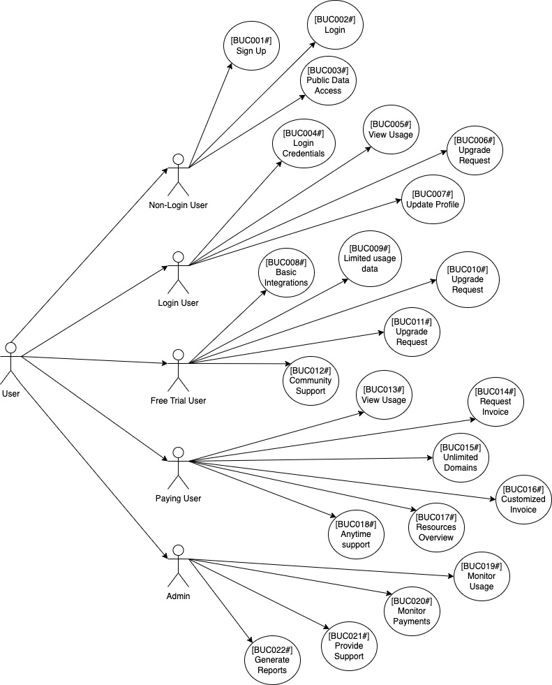
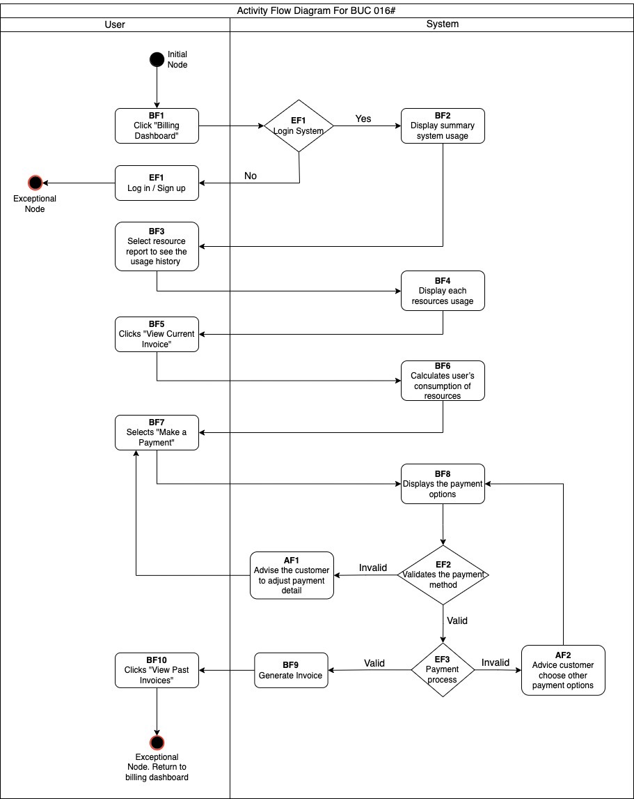
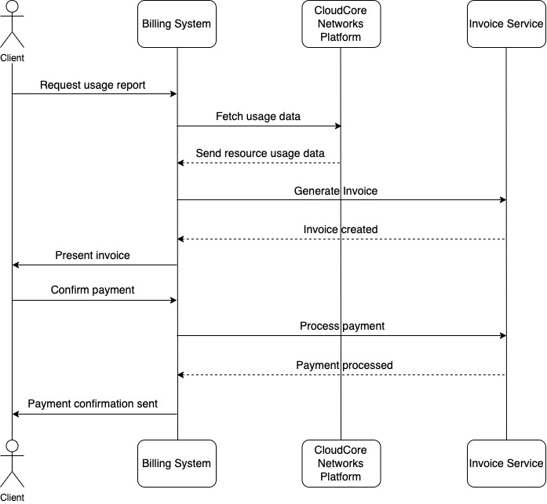

## Cloud Billing Integration System - End-to-End System Design

### Project Overview
This project demonstrates the comprehensive System Analysis and Design for the Billing Integration module within CloudCore Networks' Cloud Service Management Platform (CSMP). It bridges the gap between complex financial requirements and technical engineering execution.

### System Architecture & Workflow Diagrams

#### 1. Functional Scope (Use Case Diagram)
Defines boundaries, user roles, and key features including real-time consumption tracking and automated invoice workflows.

#### 2. Business Logic (Activity Flow)
Illustrates the chronological business process of transactional logging and credit verification.

#### 3. System Dynamics (Sequence Diagram)
Maps the exact multi-tiered interaction between the User Interface, Billing Controller, Database, and Payment Gateways (PayPal/Bank).

### Interface Prototype & User Experience (UX)
High-fidelity mockups showcasing real-time cloud resource allocation tracking, invoicing statuses, and modular account controls.

### Quality Attributes (Non-Functional Requirements)
- **Performance & Latency:** Targeted basic billing operations and dashboard updates to execute under 2 seconds.
- **Availability:** Engineered for 99.9% uptime availability with built-in emergency mechanisms to mitigate data loss.
- **Security & Compliance:** Implemented Role-Based Access Control and data encryption at rest and in transit.
