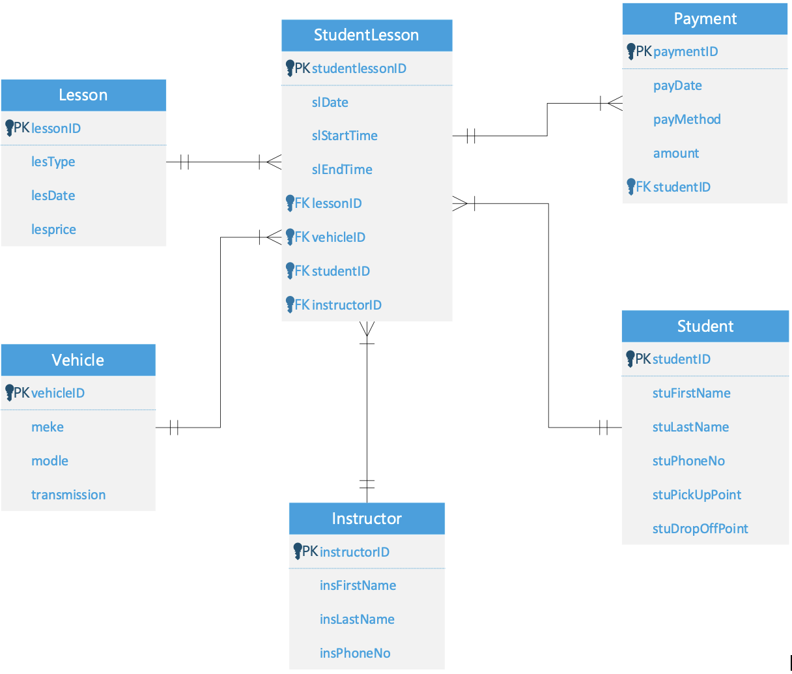

## Relational Database Design - Driving School Management System

### Project Overview
This project defines a relational database schema for an enterprise driving school implemented in Oracle SQL. It streamlines operational tracking across student profiles, instructor scheduling, fleet vehicle allocations, booking states, and transaction invoicing.

### Relational Architecture (ERD)
The model enforces strict entity constraints, handling high-frequency operational transactions and cross-table associative mapping.

#### Entity Relationship Blueprint:

### Key Database Features Implemented
- **Data Integrity & Constraints:** Configured composite reference paths using explicit `PRIMARY KEY` and `FOREIGN KEY` constraints with strict `NOT NULL` data validation.
- **Query Optimization:** Implemented indexes on foreign keys (`studentID` and `slDate`) to prevent execution latency during booking lookups.
- **Financial Analytics Querying:** Developed multi-table associative joins (`STUDENTLESSON` + `STUDENT` + `LESSON`) paired with data aggregation mechanisms to track revenue contribution matrixes per client.
