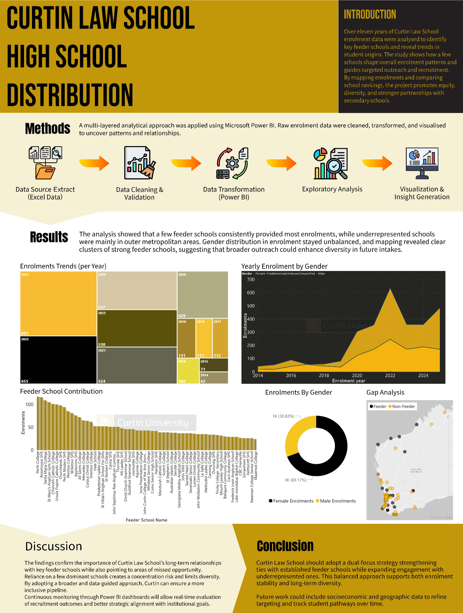

# Curtin Law School - Enrolment Distribution & Recruitment Analytics

## 📌 What this project does
This is a real-world consultancy project where my team and I analyzed 11 years of historical student enrolment data for Curtin Law School. The school was relying too heavily on a few "feeder schools," creating a concentration risk. We cleaned the data, built a Power BI dashboard, and provided strategic recommendations to help the Law School diversify its recruitment pipeline.

## 📊 Analytics Dashboard
The insights and trends were discovered using an interactive Power BI dashboard tracking student origins and gender balance.

### Dashboard Preview:

## 🚀 Key Highlights & Technical Skills

- **Handling Real-World Messy Data:** Cleaned, validated, and transformed 11 years of historical Excel enrolment records, mapping student geographic origins across Western Australia.
- **Data Transformation & Geocoding:** Used Power BI and Power Query to process geographic and school ranking data, uncovering severe cluster risks in outer metropolitan areas.
- **Consultancy & Business Strategy:** Translated complex data patterns into actionable growth strategies for university executives, helping them reduce dependency on dominant feeder schools.
- **Teamwork & Presentation:** Collaborated with a consulting team to deliver a comprehensive technical report and a pitch presentation deck directly tailored for high-level academic stakeholders.
