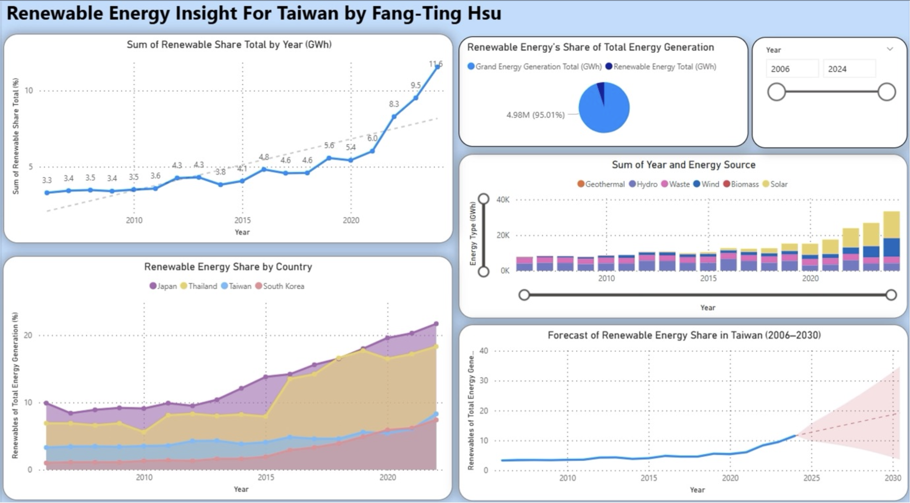

## Taiwan Renewable Energy Market Analytics & Forecasting

### Project Overview
This project analyzes Taiwan's renewable energy data and forecasts its trajectory from 2006 to 2030. By organizing raw multinational energy datasets, the project tracks energy shifts, compares regional markets, and models future sustainability targets.

### Analytics Dashboard & Visualizations
The analysis is presented through an interactive Power BI executive dashboard.

#### Executive Dashboard Preview:

### Key Analytics & Technical Capabilities

* **End-to-End ETL Infrastructure** Built ETL pipelines using Power Query to clean, normalize, and combine different multinational energy profiles.

* **Time-Series Predictive Forecasting** Used forecasting models in Power BI to project Taiwan's 2030 renewable energy market share and check if it matches sustainability targets.

* **Cross-Border Market Benchmarking** Created data models to compare national grid compositions across Japan, Thailand, South Korea, and Taiwan.

* **Macro-Environmental Risk Assessment** Analyzed regional risks regarding regulations, grid infrastructure limits, and supply chain considerations for solar and wind energy.
