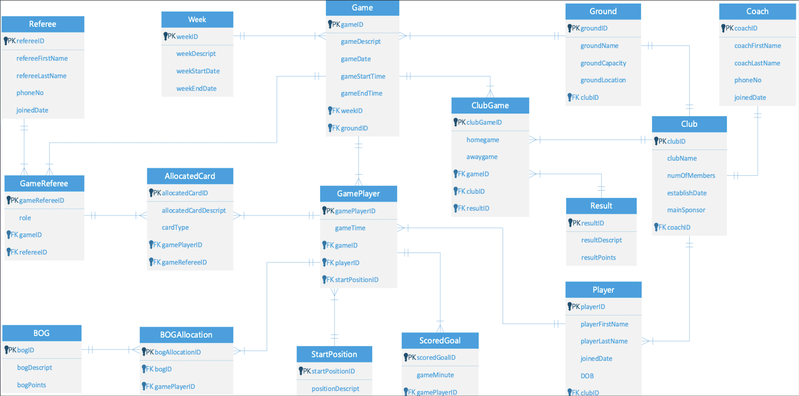

## Relational Database Design & Sports Analytics System

### Project Overview
This project delivers a fully-normalized relational database schema (3NF) built in an Oracle SQL environment to manage complex sports league operations. 
It efficiently tracks clubs, teams, player profiles, match fixture synchronization, live match event logging (goals), and referee allocations.

### Data Modeling & ERD
The schema translates multi-layered business rules into a highly integrated relational structure.

### Key Database Features Implemented
- **Referential Integrity Constraints:** Programmed explicit `PRIMARY KEY` and `FOREIGN KEY` constraints across 15+ interconnected entities to guarantee zero mapping deviations.
- **Performance Indexing:** Implemented customized B-Tree indexes on high-frequency `JOIN` paths (`GamePlayer` and `AllocatedCard`) to enhance query execution speed during seasonal scale.
- **Conditional Aggregation:** Built operational analytical queries utilizing `CASE WHEN` constructs and multi-table associative joins to calculate real-time player discipline statistics.
