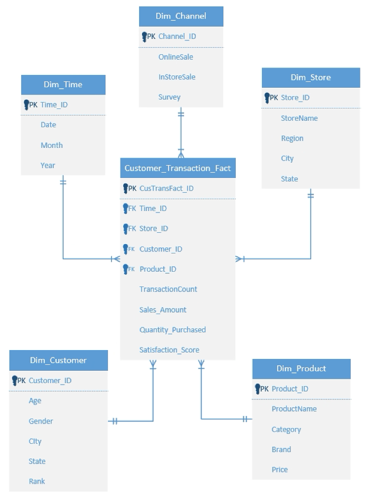

# Customer Transaction Data Warehousing & SQL Analytics

## Project Overview
This project builds a retail Data Warehouse in an Oracle SQL environment using Kimball dimensional modeling to transform purchasing logs into clean tables for business analysis.

## Data Architecture
- **Database Design:** Star Schema built for quick business queries.
- **Fact Table:** `Customer_Transaction_Fact` (Tracks TransactionCount, Sales_Amount, Quantity_Purchased, Satisfaction_Score)
- **Dimension Tables:** `Dim_Time`, `Dim_Channel`, `Dim_Store`, `Dim_Customer`, `Dim_Product`

### Architecture Blueprint:

## SQL Tech Highlights

* **Schema Implementation**
    Written `ALTER TABLE` scripts and set up strict `PRIMARY KEY` and `FOREIGN KEY` constraints to link all tables.

* **Advanced SQL Queries**
    Used deep table joins, multi level aggregations, and date filters to extract revenue trends and seasonal metrics.

* **Analytical Window Functions**
    Applied `ROW_NUMBER() OVER (PARTITION BY ... ORDER BY ...)` to rank top performing stores and customer segments.

* **Business Insights**
    Cross analyzed product categories with `Satisfaction_Score` to find lower performing brands and improve inventory.
